# Deriv P2P Sentinel 🛡️
> **AI-Powered Receipt Fraud Detection System** for the Deriv AI Talent Sprint.


## 🚨 The Challenge: P2P Payment Fraud
In P2P trading, scammers often upload **fake, photoshopped, or manipulated bank receipts** to claim they have sent payment when they haven't. Manual verification is:
- **Slow**: Delays trade release.
- **Error-Prone**: Human eyes miss subtle pixel tampering.
- **High-Risk**: Leads to financial loss for traders.

## 💡 The Solution: Multi-Agent Forensic Analysis
**Deriv P2P Sentinel** is an autonomous AI system that acts as a secure "Escrow Brain". It uses a **Swarm of Specialized AI Agents** to analyze payment receipts in real-time before releasing any funds.

### 🏗️ System Architecture

```mermaid
graph TD
    User([👤 User / Trader]) -->|Uploads Receipt| UI[🖥️ Next.js Frontend]
    UI -->|POST /api/scan| API{Gateway / Edge}
    
    subgraph "Vercel / Cloud Infrastructure"
        API -->|Rewrites| PyServer[🐍 Python Serverless Function]
    end

    subgraph "Forensic Swarm Engine"
        PyServer -->|Dispatch| Orch[🎼 Orchestrator]
        Orch -->|Trace Analysis| Meta[🕵️ Agent Meta]
        Orch -->|PII Detection| Priv[🔒 Agent Privacy]
        Orch -->|Visual Auth| Vision[🧠 Agent Vision]
        
        Meta -->|EXIF/Hex| ValidMeta{Metadata Logic}
        Priv -->|OCR/Regex| Tesseract[Tesseract OCR]
        Vision -->|Start Analysis| Gemini[✨ Google Gemini Pro]
    end

    ValidMeta -->|Signals| Aggregator[Risk Scoring Engine]
    Tesseract -->|Redacted IMG| Vision
    Gemini -->|Visual Verdict| Aggregator
    
    Aggregator -->|JSON Report| UI
    UI -->|Render| HUD[🛡️ Cyberpunk HUD]
```


### The Agent Swarm
1.  **🕵️ Agent Meta (Metadata Forensics)**
    - Extracts hidden EXIF data (GPS, software used, modify dates).
    - Detects if an image was edited in Photoshop/Canva.
2.  **🧠 Agent Vision (Visual Forensics)**
    - Analyzes pixel inconsistencies and compression artifacts.
    - Detects font mismatches and superimposed text.
3.  **🔒 Agent Privacy (PII Protection)**
    - Automatically detects and blurs sensitive user data (Phone #, CNIC, Names) *before* processing, ensuring GDPR compliance.

---

## 🚀 Key Features
- **Tactical Sci-Fi HUD**: A "Glassmorphism" interface designed for high-speed analyst work (Cyberpunk Aesthetic).
- **Real-Time Analysis**: Instant verification (< 5 seconds).
- **Cross-Platform OCR**: Intelligent text extraction with automatic fallback.
- **Privacy-First**: No PII leaves the client side without redaction.

## 🛠️ Tech Stack
- **Frontend**: Next.js 14, Tailwind CSS, Framer Motion (Tactical UI).
- **Backend**: Python (FastAPI).
- **AI/ML**: Tesseract OCR, OpenCV (Forensics), Custom Pattern Matching.
- **Infrastructure**: Vercel (Frontend), Railway/Local (Backend).

## ⚡ Quick Start

### Prerequisites
- Node.js 18+
- Python 3.9+
- Tesseract OCR (Optional for local dev)

### Installation

1.  **Clone the Repo**
    ```bash
    git clone https://github.com/awaisstack/hackderiv.git
    cd hackderiv
    ```

2.  **Frontend Setup**
    ```bash
    cd frontend
    npm install
    npm run dev
    ```

3.  **Backend Setup**
    ```bash
    cd backend
    python -m venv venv
    source venv/bin/activate  # or venv\Scripts\activate on Windows
    pip install -r requirements.txt
    python -m app.main
    ```

4.  **Access**
    - Frontend: `http://localhost:3000`
    - Backend: `http://localhost:8000`

---

## 🏆 Hackathon Tracks
Targeting: **ANTI-FRAUD** & **FINANCE OPERATIONS**

> "We don't just check the receipt; we verify the reality behind it."

---

*Built with ❤️ by Team [Your Team Name] for Deriv AI Talent Sprint 2026*
